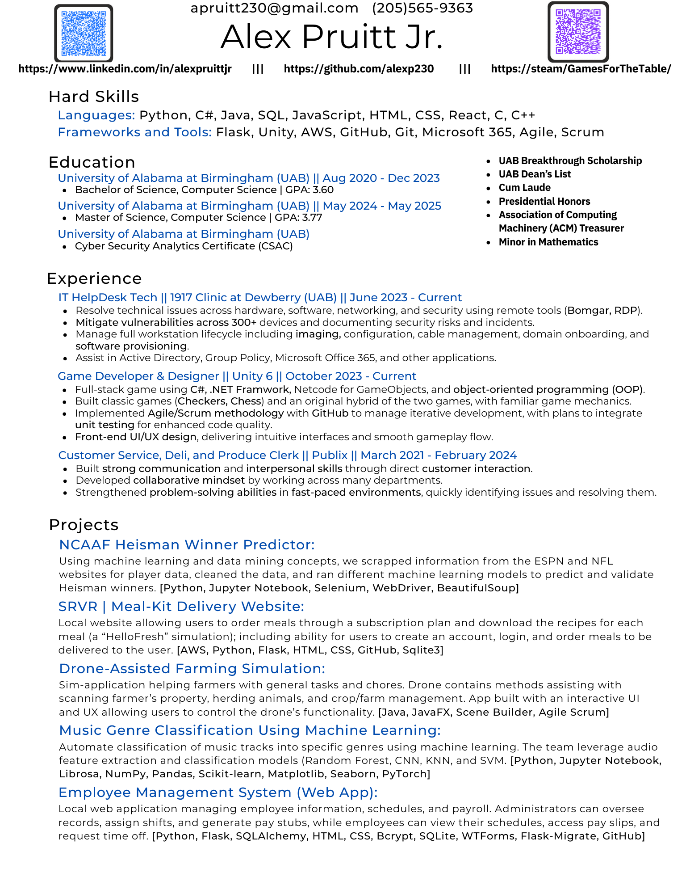

# Alex Pruitt Jr.

**Contacts:**

- Phone Number: 205-565-9363
- Email: [apruitt230@gmail.com](mailto:apruitt230@gmail.com)

**About Me:**

From UAB, I have obtained a Bachelor's and Master's in Computer Science (BS). I have learned a large amount about computer security, coding styles, data structures, and so much more. It was awesome getting to meet many different people and professors throughout the five years at UAB.
 
Currently, I work at UAB 1917 Clinic at Dewberry as an IT Helpdesk Technician for around two years. Here, I maintain, update, and eliminate vulnerabilities for over 300 users and computers and provide assistance to individuals over the phone, through email, and in-person.

A personal project that I am working on is a local and multiplayer game using Unity, C#, .NET, and object-oriented principles. This has been a project around two years in the making and has helped me improve my time management abilities and workflow management.

-------------------------------------------------------------------------------------------------------------------------------------------------------------------------------------------------------------------------------

