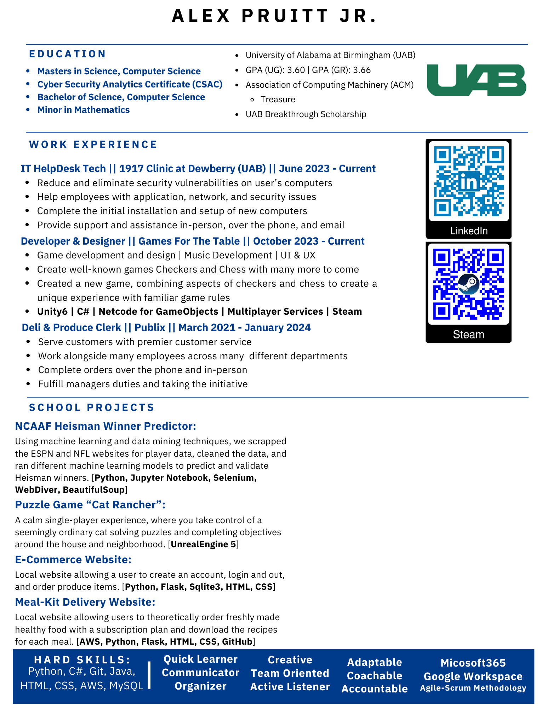

# Alex Pruitt Jr.

**Contacts:**

- Phone Number: 205-565-9363
- Email: [apruitt230@gmail.com](mailto:apruitt230@gmail.com)

**About Me:**
Alongside my bachelors in Computer Science and a minor in Mathematics, obtained from the University of Alabama at Birmingham (UAB); I am pursuing a masters in Computer Science and a Cyber Security Analytics Certificate, expecting to graduate with both in Spring 2025. Being at UAB, I am glad to have the opportunity to learn about computers, algorithms, coding languages, programs, applications, how to satisfy customers or clients needs, and how to work with group/team members in an effective way. Whether it be building a full-fledged video game, building a website, or some other type of program/project, I have had a blast learning alongside my friends and I am ready to use what I have learned in the real world. 

While pursuing my degree, I have worked at Publix for three years and later moved to the 1917 Clinic at Dewberry as an IT HelpDesk Specialist where I work now. There, I help the employees with problems that may occur while they are working. Here, providing great customer service, making sure to properly explain directions, and to have great communication is of utmost importance to me. Here, I also will try and reduce the amount of vulnerabilities on the computers of the employees who work there.

**College:**
- Senior at the University of Alabama at Birmingham (UAB)
- Pursuing a Computer Science (BS) degree with a minor in Mathematics
- Passionate about computers, algorithms, coding languages, and applications

- Experienced in building websites, games, databases
- Gain experience with working with customers and clients
- Work in large and small groups

**Work Experience:**
- IT HelpDesk Specialist at the 1917 Clinic at Dewberry
- Providing excellent customer service and technical support
- Ensuring the security of employees' computers

